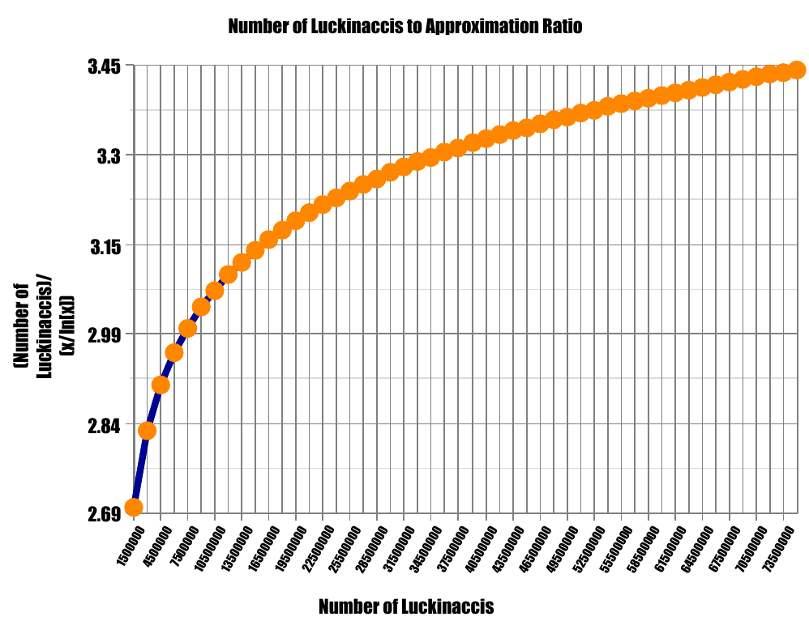

# The Luckinacci Sieve

The Prime Number sequence famously makes appearances in many fields such as physics, mathematics, and cryptography. The prime numbers can be generated in an elementary fashion using the <a href="http://mathworld.wolfram.com/SieveofEratosthenes.html" target="_blank">Sieve of Eratosthenes</a>, where we list all the natural numbers from  to , and eliminate every multiple of , then every multiple of , then , and so on continuing from the next remaining number from the start of the list. We continue this process until we have crossed out every multiple of . The first 100 prime numbers are:

<p align="center">2, 3, 5, 7, 11, 13, 17, 19, 23, 29, 31, 37, 41, 43, 47, 53, 59, 61, 67, 71, 73, 79, 83, 89 and 97.</p>

There exist functions designed to approximate the number of primes less than some specific limit ; one of the most prominent being the <a href="http://mathworld.wolfram.com/PrimeCountingFunction.html" target="_blank">Prime Counting Function</a>,  (which the Sieve of Eratosthenes implies). From earlier, we can see that there are  prime numbers less than . If we set , we can compute <p align="center"></p>

The generation of the <a href="http://mathworld.wolfram.com/LuckyNumber.html" target="_blank">Lucky Number</a> sequence is similar to the Sieve of Eratosthenes. We begin by writing out all the odd numbers, and declaring  lucky, and identifying the next number in the list after :

<p align="center">1, <strong>3</strong>, 5, 7, 9, 11, 13, 15, 17, 19, 21, 23, 25, 27, 29, 31, 33, 35, 37, 39, 41, 43, 45...</p>

Clearly  is the next surviving number (hence the term "lucky"), we go back to the start of the list and eliminate every  number. 

<p align="center">1, 3, <strong>7</strong>, 9, 13, 15, 19, 21, 25, 27, 31, 33, 37, 39, 43, 45...</p>

Afterwards, we declare the next surviving number (), and continue the process as desired. The lucky numbers up to  are:

<p align="center">1, 3, 7, 9, 13, 15, 21, 25, 31, 33, 37, 43, 49, 51, 63, 67, 69, 73, 75, 79, 87, 93, 99.</p>

By inspection, we see that there are  Lucky numbers up to 100. Indeed, the prime numbers and the lucky numbers share similarities, and it is conjectured that the Lucky numbers also follow the Prime Counting Function. A research group conducted under Dr. Paul Oeser and Dr. Jack Bennett in 2012 investigated this link and produced numerical results up to  showing the link, and determined the Lucky-Primes up to .

A follow-up to that research in 2013 was investigating a new numerical sieve combining the idea of Lucky numbers with the <a href="http://mathworld.wolfram.com/FibonacciNumber.html">Fibonacci sequence</a>. The question we hoped to answer was whether or not the Lucky-Fibonacci mixture (titled <strong>The Luckinacci Sequence</strong>) also followed the Prime Counting Function and other properties conjectured to be shared by primes and luckies. The Luckinacci sieve uses the idea of the Lucky number sieve, but instead the number we use as the counter for elimination is based on the Fibonacci sequence:

<p align="center">0, 1, 1, 2, 3, 5, 8, 13, 21, 34, 55, 89, 144, 233, 377, 610, 987, 1597, 2584, 4181, 6765...</p>

starting from seed values  and . The Luckinacci numbers up to  are:

<p align="center">1, 3, 7, 9, 15, 19, 21, 31, 33, 37, 39, 45, 51, 61, 63, 67, 69, 75, 79, 81, 93, 97, 99.</p>

There are  Luckinaccis less-than-or-equal-to , which initially gave us hope that the Luckinaccis could also be approximated with .

A C++ program was developed to generate the Luckinacci sequence, which can be found in this Github repository. The program provided data for Luckinacci numbers and Luckinacci primes up to . <strong>The results were presented in October 2013 at the Louis Stokes Alliances for Minority Participation (LSAMP) conference, and later at the 2013 Texas Undergraduate Mathematics Conference (TUMC)</strong>.

# Analysis of the data

Both the Prime and Lucky number sieves have similar behaviors in that the number of primes (resp. Lucky numbers) 
less than a given number can be approximated with the formula , where  represents the number of primes (resp. Lucky numbers) less than or equal to . What we wanted to observe as part of our research project was to see if there was any suggestion that the Luckinacci number sieve would follow the same approximation for distribution, , that both the Lucky and Prime number sieves do. In particular, for the prime number sieve the approximation ratio  should converge to  as . Additionally, based on evidence, it is conjectured that for the Lucky number sieve, as , the approximation ratio also appears to converge to . Below is the graph that shows the relationship between the number of Luckinacci numbers  divided by the  and .

<p align="center"></p>

The above graph seems to suggest that the Luckinacci numbers 
compared to the ratio used for both the prime and Lucky numbers sieves does not appear to converge 
to , which means that Luckinacci numbers are more abundant than either primes or Lucky Numbers, 
and that  in particular is not a good approximation for the Luckinacci numbers .

An additional calculation that we focused on was a ratio of the number of 
Luckinaccis that were also prime numbers (Luckinacci-Primes) to the number of prime numbers 
. The ratio calculations, along with Euclid's theorem on the infinitude of primes, were 
designed to help answer the question, "<em>Could there be an infinite 
amount of Luckinacci-primes?</em>" The following list is an excerpt of the ratio 
calculations for several values of :

```
The ratio of Luckinacci-Primes to Primes less than 100000 is 0.294203
The ratio of Luckinacci-Primes to Primes less than 200000 is 0.295151
The ratio of Luckinacci-Primes to Primes less than 300000 is 0.295611
The ratio of Luckinacci-Primes to Primes less than 400000 is 0.294979
The ratio of Luckinacci-Primes to Primes less than 500000 is 0.295488
The ratio of Luckinacci-Primes to Primes less than 600000 is 0.295592
The ratio of Luckinacci-Primes to Primes less than 700000 is 0.29581
The ratio of Luckinacci-Primes to Primes less than 800000 is 0.295539
The ratio of Luckinacci-Primes to Primes less than 900000 is 0.295942
The ratio of Luckinacci-Primes to Primes less than 1000000 is 0.296224
The ratio of Luckinacci-Primes to Primes less than 1100000 is 0.295984
The ratio of Luckinacci-Primes to Primes less than 1200000 is 0.296187
The ratio of Luckinacci-Primes to Primes less than 1300000 is 0.296268
The ratio of Luckinacci-Primes to Primes less than 1400000 is 0.2961
The ratio of Luckinacci-Primes to Primes less than 1500000 is 0.296334
The ratio of Luckinacci-Primes to Primes less than 1600000 is 0.296226
The ratio of Luckinacci-Primes to Primes less than 1700000 is 0.296166
The ratio of Luckinacci-Primes to Primes less than 1800000 is 0.295864
The ratio of Luckinacci-Primes to Primes less than 1900000 is 0.29589
The ratio of Luckinacci-Primes to Primes less than 2000000 is 0.295912
The ratio of Luckinacci-Primes to Primes less than 2100000 is 0.296094
...........................
The ratio of Luckinacci-Primes to Primes less than 73000000 is 0.296169
The ratio of Luckinacci-Primes to Primes less than 73100000 is 0.296168
The ratio of Luckinacci-Primes to Primes less than 73200000 is 0.29617
The ratio of Luckinacci-Primes to Primes less than 73300000 is 0.296167
The ratio of Luckinacci-Primes to Primes less than 73400000 is 0.296159
The ratio of Luckinacci-Primes to Primes less than 73500000 is 0.296163
The ratio of Luckinacci-Primes to Primes less than 73600000 is 0.296169
The ratio of Luckinacci-Primes to Primes less than 73700000 is 0.296176
The ratio of Luckinacci-Primes to Primes less than 73800000 is 0.296167
The ratio of Luckinacci-Primes to Primes less than 73900000 is 0.29618
The ratio of Luckinacci-Primes to Primes less than 74000000 is 0.296186
The ratio of Luckinacci-Primes to Primes less than 74100000 is 0.296177
The ratio of Luckinacci-Primes to Primes less than 74200000 is 0.296187
The ratio of Luckinacci-Primes to Primes less than 74300000 is 0.296193
The ratio of Luckinacci-Primes to Primes less than 74400000 is 0.296192
The ratio of Luckinacci-Primes to Primes less than 74500000 is 0.29619
The ratio of Luckinacci-Primes to Primes less than 74600000 is 0.296189
The ratio of Luckinacci-Primes to Primes less than 74700000 is 0.296191
The ratio of Luckinacci-Primes to Primes less than 74800000 is 0.296187
The ratio of Luckinacci-Primes to Primes less than 74900000 is 0.296188
The ratio of Luckinacci-Primes to Primes less than 75000000 is 0.296181
```
# Conclusions

While most other tests and ratiosproved inconclusive, the latter ratio appeared to show that the number of Luckinacci-primes to primes had a roughly
constant result of about  to the highest computable limit of . The result of a constant ratio in the experiment
appeared to imply that for every three Luckinacci-primes, there are about ten prime numbers. This, combined 
with the well known fact that there are infinitely many primes, suggests that there are infinitely many Luckinacci 
primes as well.

